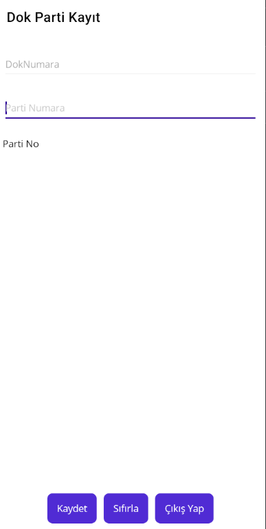
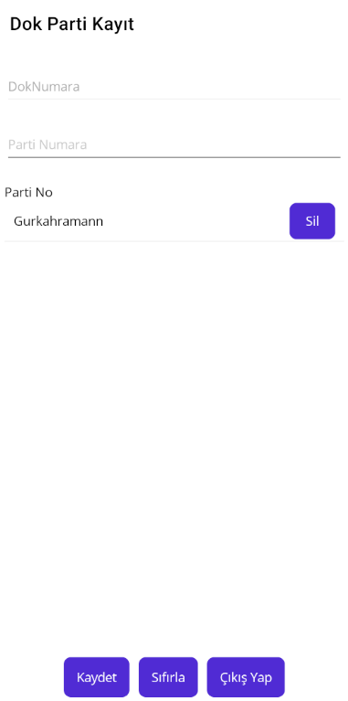

# Dok Mobil Kayıt Application
Dok Mobil Kayıt was the first mobile application I developed during my internship. This application matches party numbers with their respective Dok numbers. It records the history, including the Dok number, party number, and their associated IDs.
The application is integrated with an ERP system, ensuring that the latest party information is always updated with the most recent Dok location. The project was developed using Entity Framework and MSSQL. The API was published and deployed on IIS servers.
#Below are some screenshots from the application:
######

